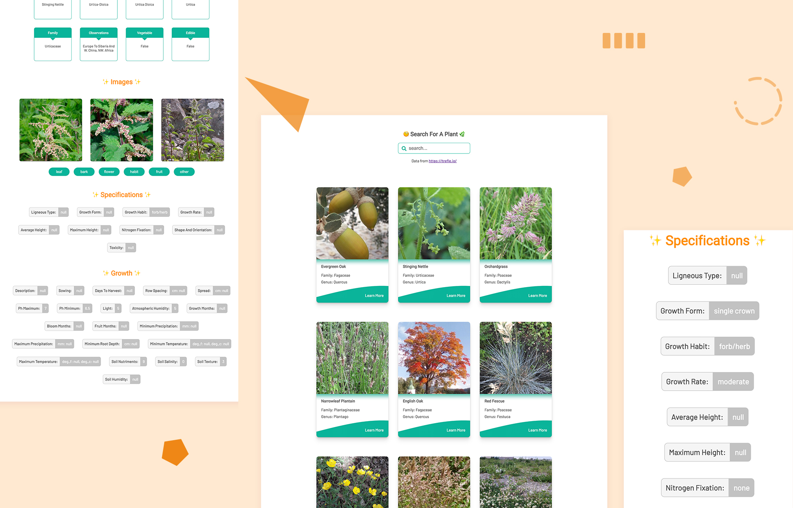

# Trefle React App

## 🎉 **[Live Demo](https://trefle-react.web.app/)** 🎉

---

---

# Description

A plant search app using React and the Trefle (a global plants API) to show the plant information.

# Main Features

- Used **styled-components** to style react components, created theme and global style to make less code and more consistency
- Used Async/Await with **Axios** to fetch the [Trefle API](https://trefle.io/) data
- Created a backend server with **Node.js** to request a client-side token and get a **JWT** token which can be usable on the client side
- Used **React Hook** to perform react state and lifecycle methods inside functional components
- Used **React Router** for routing functionalities
- Created **infinite scroll** function with Intersection Observer API
- Looped through objects and arrays to display data cards
- CI/CD integration with **Firebase**
- Responsive layouts depending on device's screen size

# Credits

- Data from [Trefle API](https://trefle.io/)
- Coded by [Danica](https://github.com/wandanli)
